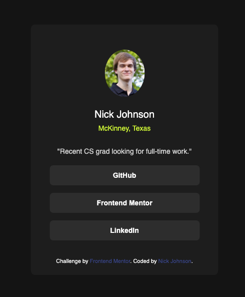

# Frontend Mentor - Social links profile solution

This is a solution to the [Social links profile challenge on Frontend Mentor](https://www.frontendmentor.io/challenges/social-links-profile-UG32l9m6dQ). Frontend Mentor challenges help you improve your coding skills by building realistic projects.

## Table of contents

- [Overview](#overview)
  - [The challenge](#the-challenge)
  - [Screenshot](#screenshot)
  - [Links](#links)
- [My process](#my-process)
  - [Built with](#built-with)
  - [What I learned](#what-i-learned)
  - [Continued development](#continued-development)
- [Author](#author)

## Overview

### The challenge

Users should be able to:

- See hover and focus states for all interactive elements on the page

### Screenshot

### Links

- Live Site URL: [https://njohnson68.github.io/FrontendMentor-social-links-profile/](https://njohnson68.github.io/FrontendMentor-social-links-profile/)

## My process

### Built with

- Semantic HTML5 markup
- CSS custom properties

### What I learned

This project was a good refresher/practice of the things I had learned about using HTML and CSS.

### Continued development

In general, I look forward to keep learning and growing my skills in HTML/CSS and eventually start getting into Javascript with future projects.

## Author

- Github - [njohnson68](https://github.com/njohnson68)
- Frontend Mentor - [@njohnson68](https://www.frontendmentor.io/profile/njohnson68)
